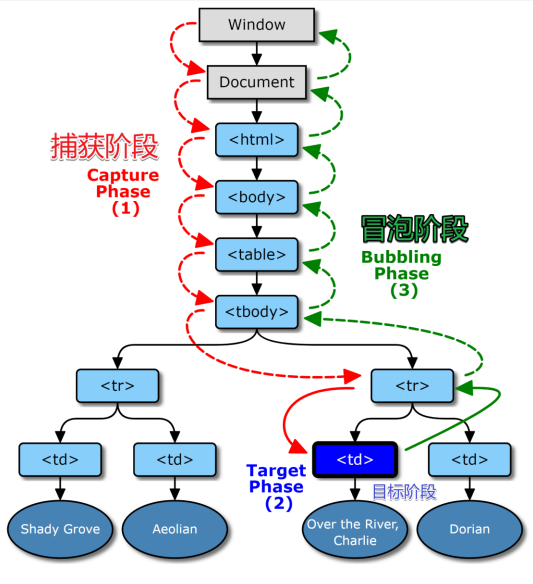

# DOM 事件模型

## 事件流

**事件流有三个阶段：事件捕获阶段、目标阶段、事件冒泡阶段。**

1. 事件捕获
   事件捕获是 Netscape 浏览器开发团队提出的，很有意思，他们思想是从不具体的节点到最具体的节点，一般是从 document 对象开始传播，不过很少人用事件捕获的，还是事件冒泡用的多。
2. 事件冒泡
   事件冒泡是 IE 的事件流，事件是由最具体的元素接收，然后逐级向上传播，在每一级的节点上都会发生，直到传播到 document 对象。Chrome 这样的浏览器会冒泡到 window 对象（很容易记忆，联想水里的泡泡不也这样么）。



**图中[td]被点击，其上节点[tr]到[window]都可以加上 onclick 事件去执行函数。函数执行顺序分两种，从[window]到[tr]定义为捕获，从[tr]到[window]定义为冒泡。**

## 用户使用顺序和阻止冒泡

```javascript
e.addEventLisenter("click", f2, true); // true按捕获方向执行函数

e.addEventLisenter("click", f2, false); // false按冒泡方向执行函数

e.stopPropagation(); //可以中断冒泡。
```

**捕获事件无法取消**
