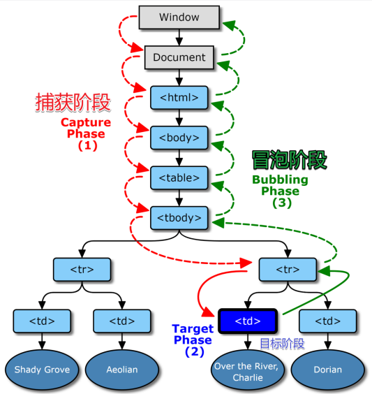

# DOM 事件模型和事件委托

## 事件模型

**事件模型有三个阶段：事件捕获阶段、目标阶段、事件冒泡阶段。**

1. 事件捕获
   事件捕获是 Netscape 浏览器开发团队提出的，很有意思，他们思想是从不具体的节点到最具体的节点，一般是从 document 对象开始传播，不过很少人用事件捕获的，还是事件冒泡用的多。
2. 事件冒泡
   事件冒泡是 IE 的事件流，事件是由最具体的元素接收，然后逐级向上传播，在每一级的节点上都会发生，直到传播到 document 对象。Chrome 这样的浏览器会冒泡到 window 对象（很容易记忆，联想水里的泡泡不也这样么）。



**图中[td]被点击，其上节点[tr]到[window]都可以加上 onclick 事件去执行函数。函数执行顺序分两种，从[window]到[tr]定义为捕获，从[tr]到[window]定义为冒泡。**

## 用户使用顺序和阻止冒泡

```javascript
e.addEventListener("click", f2, true); // true按捕获方向执行函数

e.addEventListener("click", f2, false); // false按冒泡方向执行函数

e.stopPropagation(); //可以中断冒泡。
```

**捕获事件无法取消**

## 事件委托

**事件委托，通俗地来讲，就是把一个元素响应事件（click、keydown......）的函数委托到另一个元素。通常是一组元素的事件委托到它的父层或者更外层元素上，真正绑定事件的是外层元素，当事件响应到需要绑定的元素上时，会通过事件冒泡机制从而触发它的外层元素的绑定事件上，然后在外层元素上去执行函数。**

```html
<ul id="list">
  <li>1</li>
  <li>2</li>
  <li>3</li>
</ul>
```

```javascript
function on(eventType, element, selector, fn) {
  if (!(element instanceof Element)) {
    element = document.querySelector(element);
  }
  element.addEventListener(eventType, (e) => {
    const t = e.target;
    if (t.matches(selector)) {
      fn(e);
    }
  });
}
on("click", "#list", "li", (e) => {
  console.log(e.target.innerHTML);
});
```
