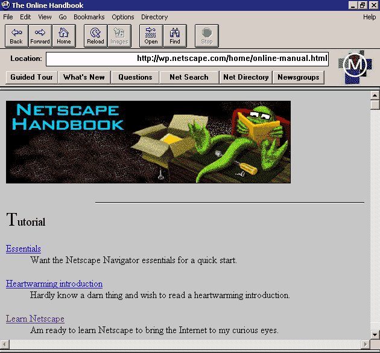

# JavaScript 的诞生

## JavaScript的诞生背景

&emsp;&emsp;1994年，在互联网刚兴起的时代，网景公司（Netscape）发布了Navigator浏览器0.9版。这是历史上第一个比较成熟的网络浏览器，轰动一时。但是，这个版本的浏览器只能用来浏览，不具备与访问者互动的能力。因此网景公司急需一种网页脚本语言，使得浏览器可以与网页互动。



&emsp;&emsp;网页脚本语言到底是什么语言？网景公司当时有两个选择：一个是采用现有的语言，比如Perl、Python、Tcl、Scheme等等，允许它们直接嵌入网页；另一个是发明一种全新的语言。这两个选择各有利弊。第一个选择，有利于充分利用现有代码和程序员资源，推广起来比较容易；第二个选择，有利于开发出完全适用的语言，实现起来比较容易。

&emsp;&emsp;当时Sun公司将Java正式推向市场。宣传Java可以一次编译，到处运行。网景公司动了心，决定与Sun公司结成联盟。因此，JavaScript后来就是网景和Sun两家公司一起携手推向市场的。

## JavaScript诞生

&emsp;&emsp;1995年4月，BrendanEich（布兰登·艾奇） 加入网景公司。Brenden原本研究方向是函数式编程与Scheme语言。但是1995年5月，网景公司指定Brenden成为了“新语言”的设计师。并且要求这个“新语言”要和Java足够的相似（面向对象思想），但是要比Java能够更加简单地上手。Brenden志不在此，而且对Java完全不感兴趣，为了完成任务他花了10天时间便把这门“新语言”的最初版本设计了出来。总的来说他的设计思路是这样的：

     （1）借鉴C语言的基本语法；
     （2）借鉴Java语言的数据类型和内存管理；
     （3）借鉴Scheme语言，将函数提升到"第一等公民"（first class）的地位；
     （4）借鉴Self语言，使用基于原型（prototype）的继承机制。
&emsp;&emsp;所以，Javascript语言实际上是两种语言风格的混合产物——（简化的）函数式编程+（简化的）面向对象编程。

## JavaScript的10个设计缺陷

1. 不适合开发大型程序
2. 非常小的标准库
3. null和undefined
    ```javascript
    typeof null; // object
    typeof undefined; // undefined
    var foo;
    alert(foo == null); // true
    alert(foo == undefined); // true
    alert(foo === null); // false
    alert(foo === undefined); // true
    /* 在编程实践中，null几乎没用，根本不应该设计它。 */
    ```
4. 全局变量难以控制
   
   ```javascript
    a = 1;
    (function(){
        b=2;
        alert(a);
    })(); // 1
        alert(b); //2
    /* 推荐使用局部变量let和const */
    ```

5. 自动插入行尾分号
6. 加号运算符

    可以表示数字与数字的和，也可以表示字符与字符的连接。
7. NaN

    ```javascript
    NaN !== NaN; //true
    ```

8. 数组和对象的区分

    ```javascript
    if ( arr &&typeof arr === 'object' &&typeof arr.length === 'number' &&!arr.propertyIsEnumerable('length')){
        alert("arr is an array");
    }
    /* js的数组也属于对象（object），所以要区分一个对象到底是不是数组，相当麻烦 */
    ```

9.  == 和 ===

     推荐任何时候都使用"==="（精确判断）比较符

10. 基本类型的包装对象

    ```javascript
    alert( typeof 1234); // number
    alert( typeof new Number(1234)); // object
    /* 基本数据类型和建构函数造成的混淆很大 */
    ```