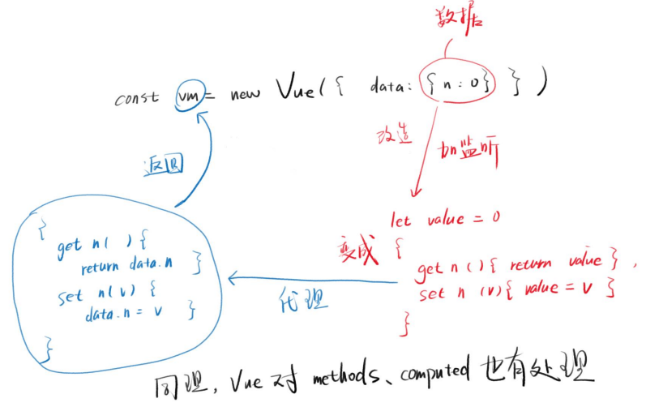

# Vue 数据响应式理解

将一个普通的 js 对象传入 vue 的 data 选项中，Vue 会遍历这个对象所有的属性，并使用 Object.defineProperty 把这些属性全部转为 getter/setter。

```js
// Vue响应式demo
const data = {
  name: "小明",
  age: 18,
};
function observer(target) {
  if (typeof target !== "object" || target === null) return;

  for (let key in target) {
    defineReactive(target, key, target[key]);
  }
}
function defineReactive(target, key, value) {
  Object.defineProperty(target, key, {
    get() {
      return value;
    },
    set(newValue) {
      if (newValue !== value) {
        value = newValue;
        console.log("更新视图");
      }
    },
  });
}
observer(data);
data.name = "小白";
```



vue 不能检测到对象属性的添加或者删除，解决方法式手动调用 Vue.set 或者 vm.$set。

如果是数组需要变更，vue 也提供了七个方法：

- push()
- pop()
- shift()
- unshift()
- splice()
- sort()
- reverse()

```js
// 模仿Vue包裹数组方法
class VueArray extends Array {
  push(...args) {
    const oldLength = this.length;
    super.push(...args);
    for (let i = oldLength; i < this.length; i++) {
      // 将每个新增的key都告诉Vue
      Vue.set(this, i, this[i]);
    }
  }
}
```
